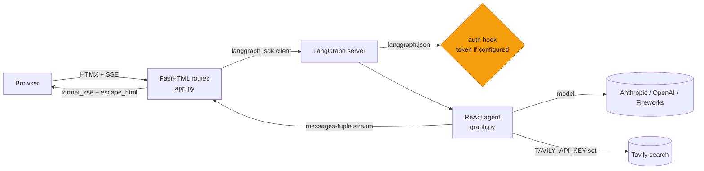
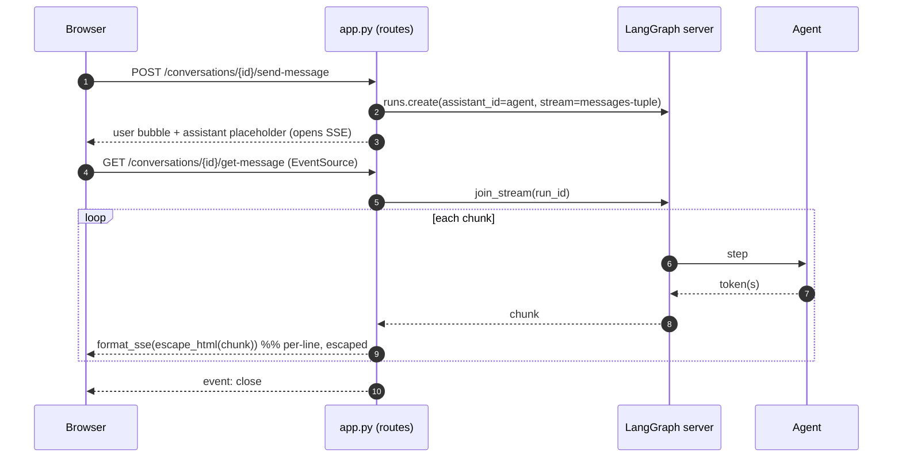

# Full-stack Python chatbot with LangGraph

[](https://github.com/daniellopez882/langgraph-fullstack-python/actions/workflows/ci.yml)


A ReAct agent and a streaming chat UI in **one LangGraph deployment**. The
graph, a deployment auth hook, and a [FastHTML](https://fastht.ml/) interface
are wired together by `langgraph.json` — custom HTTP routes on a LangGraph
server, so the UI streams responses over Server-Sent Events from the same
process that runs the agent.

> Derived from the [LangGraph react-agent template](https://github.com/langchain-ai/react-agent)
> and the [AnswerDotAI FastHTML SSE example](https://github.com/AnswerDotAI/fasthtml-example/blob/main/04_sse/sse_chatbot.py).
> The point of the repo is to show custom routes and streaming on a LangGraph
> deployment; the chat UI is intentionally a demo.

## At a glance

| | |
|---|---|
| **Is** | A LangGraph deployment: a configurable ReAct agent + a FastHTML SSE chat UI, run by `langgraph dev` / `langgraph build` |
| **Agent** | Model, prompt and tools are configuration. With `TAVILY_API_KEY` set, the agent gets web search — the dependency the old graph shipped but never used |
| **Auth** | Permissive by default for local dev; set `AUTH_TOKEN` to require `Authorization: Bearer <token>` on the deployment API |
| **Tests** | 38 — no model, no network, no running server; framing, escaping, auth, graph wiring and app boot are unit-tested |
| **CI** | ruff · `ruff format --check` · `mypy` · pytest on 3.11/3.12 · an auth-enforcement check · bandit · gitleaks · container built and its readiness probe hit |

## Architecture



### A streamed reply



## Getting started

```bash
uv sync --dev          # or: pip install -e ".[dev]"
cp .env.example .env   # set a provider key; optionally TAVILY_API_KEY and AUTH_TOKEN
uv run langgraph dev --no-browser
```

The deployment is at `http://localhost:2024`; the chat UI is mounted on it.

### Container

```bash
docker build -t react-agent .
docker run --rm -p 2024:2024 --env-file .env react-agent
```

## Configuration

| Variable | Default | Notes |
|---|---|---|
| `MODEL` | `anthropic:claude-3-5-haiku-latest` | Any LangChain `provider:model` string |
| `SYSTEM_PROMPT` | a friendly persona | |
| `TAVILY_API_KEY` · `TAVILY_MAX_RESULTS` | — · `3` | Present ⇒ the agent gets web search |
| `AUTH_TOKEN` | *(empty)* | Set ⇒ the deployment API requires `Bearer <token>` |
| `LANGGRAPH_URL` | `http://127.0.0.1:2024` | Where the UI reaches the server |

## What changed, and why

| # | Defect | Effect |
|--:|---|---|
| 1 | `create_react_agent(..., tools=[])` while depending on `tavily-python` | A "tool-calling agent" that could not act; a dead dependency |
| 2 | The model was hardcoded | The three provider keys in `.env.example` implied a choice the code did not offer |
| 3 | The auth hook returned `"default_user"` for every caller | The model-spending deployment API was open to anyone who could reach it |
| 4 | `yield f"event: message\ndata: {content}\n\n"` | A multi-line reply broke SSE framing and rendered wrong |
| 5 | Streamed content was swapped into the DOM as `innerHTML` unescaped | A model reply (or quoted tool result) with `<script>` ran in the browser |
| 6 | `from fasthtml.common import picolink` with `python-fasthtml>=0.12.1` | fasthtml dropped `picolink` after 0.12; a fresh install resolved 0.14 and the server died at boot with `ImportError` — no test imported the module, so only booting the container caught it |

<details>
<summary>Also</summary>

No tests and no CI; the `langgraph_sdk` client was created with no URL; there was no container. The FastHTML UI still carries its own honest "unauthenticated demo" banner — hardening the transport (ADR 0002) does not change the trust model of a public demo (see the threat model).

</details>

## Design notes

| Record | Decision |
|---|---|
| [ADR 0001](docs/adr/0001-tools-model-and-auth-are-configuration.md) | Model, tools and auth are configuration, not constants |
| [ADR 0002](docs/adr/0002-sse-framing-and-escaping.md) | SSE is framed per line; model output is escaped before the DOM |
| [Threat model](docs/threat-model.md) | Assets, five threats, what a public demo does not address |

## Layout

```
src/react_agent/
  graph.py     the ReAct agent, built from config; exposes `graph` for langgraph.json
  config.py    settings (model, prompt, tools, auth, url)
  auth.py      the deployment auth hook; is_authorized / resolve_identity
  sse.py       format_sse (per-line framing) + escape_html
  app.py       FastHTML routes and the streaming UI
langgraph.json the deployment wiring (graph + auth + http app)
tests/         38 tests
docs/          ADRs, threat model
```

## Limits

- This is a starter/demo derived from two upstream templates; the UI is not a hardened product.
- Thread ownership in the UI is a client-set cookie (see the threat model).
- Nothing here has been run against a model provider; the tests use stubs.

## Licence

MIT — see [LICENSE](LICENSE).
